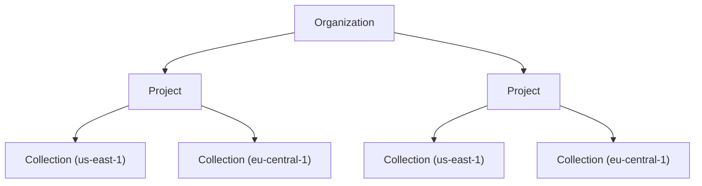

TopK is a fully-featured search engine SDK that combines the power of keyword search, vector search, semantic search, and reranking into a single, unified API. With automatic embeddings and an intuitive query language, TopK makes it easy to build powerful search experiences without managing complex infrastructure.

## What is TopK?

TopK provides a complete search solution that supports:

- **Semantic search** - Find content by meaning, not just keywords, with automatic embeddings
- **Keyword search** - Traditional text matching with BM25 scoring
- **Vector search** - Dense and sparse vector similarity search
- **Multi-vector search** - Token-level or patch-level embeddings for fine-grained matching
- **Metadata filtering** - Combine search with structured filters
- **Reranking** - Built-in reranking models to improve result relevance
- **Hybrid search** - Mix and match different search methods in a single query

## Key features

<CardGroup cols={2}>
  <Card title="Automatic embeddings" icon="sparkles">
    No need to manage external embedding models - TopK handles embeddings automatically with `semantic_index()`
  </Card>
  
  <Card title="Unified query language" icon="code">
    Express complex queries combining semantic similarity, keyword matching, and filters in a single, composable API
  </Card>
  
  <Card title="Built-in reranking" icon="arrows-up-down">
    Improve relevance with a single `.rerank()` call - no external services required
  </Card>
  
  <Card title="Flexible schemas" icon="table">
    Define required fields with type safety while allowing additional fields at insert time
  </Card>
</CardGroup>

## When to use TopK

TopK is ideal for applications that need:

**Semantic understanding**
- You want to find content by meaning, not just exact keyword matches
- Users search using natural language queries
- Your content has rich semantic context (documents, articles, descriptions)

**Hybrid search capabilities**
- You need both keyword and semantic search
- Your use case benefits from combining multiple search strategies
- You want to filter results by metadata while performing semantic search

**Rapid development**
- You want to avoid managing embedding models and vector databases separately
- You need a simple API that handles complexity under the hood
- You want built-in reranking without external dependencies

**High-performance search**
- You need low-latency search at scale
- Your application requires multi-vector search for fine-grained matching
- You want efficient hybrid search combining multiple retrieval methods

## Architecture

TopK follows a hierarchical structure:

- **Organization** - Your top-level account
- **Project** - A logical grouping of collections with a dedicated API key
- **Collection** - A container for documents with a defined schema, stored in a specific region

<Info>
  Each collection is region-specific. You specify the region when creating a client, and all operations are performed against that region.
</Info>

## Data model

**Collections** are the core data structure in TopK. Each collection:
- Has a schema that defines field types and indexes
- Stores documents as JSON-style dictionaries
- Requires each document to have an `_id` field
- Supports flexible schemas (fields not in schema can still be inserted)

**Documents** are stored as key-value pairs where:
- Keys are field names (strings)
- Values can be text, numbers, booleans, vectors, lists, matrices, or bytes
- The `_id` field is required and serves as the unique identifier

## Available SDKs

TopK provides official SDKs for:

<CardGroup cols={2}>
  <Card title="Python SDK" icon="python" href="/sdk/python/client">
    Full-featured Python client with sync and async support
  </Card>
  
  <Card title="JavaScript SDK" icon="js" href="/sdk/javascript/client">
    TypeScript-compatible JavaScript client for Node.js and modern browsers
  </Card>
</CardGroup>

## Next steps

<CardGroup cols={2}>
  <Card title="Installation" icon="download" href="/installation">
    Install the TopK SDK and set up your API key
  </Card>
  
  <Card title="Quickstart" icon="rocket" href="/quickstart">
    Build your first search application in 5 minutes
  </Card>
  
  <Card title="Regions" icon="globe" href="/regions">
    Learn about available regions and data storage
  </Card>
  
  <Card title="Create a collection" icon="folder" href="/collections/create">
    Deep dive into collection schemas and indexes
  </Card>
</CardGroup>
